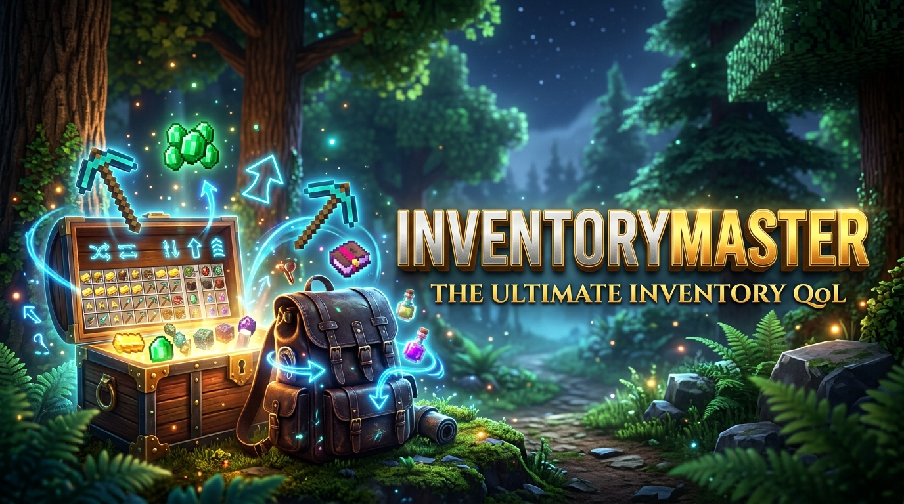

# 🎒 InventoryMaster — Ultimate Inventory QoL Mod

  

  

    
    
    
    
  

---

**The ultimate 1-click inventory & chest management, quick stacking, auto-refill, and tool durability protection mod for Minecraft (1.21 – 26.2)!**

---

## ⚡ Features

### 🔄 1-Click Smart Inventory & Chest Sorting
- **Smart Category Sorting**: Groups your items logically by Combat, Tools, Armor, Minerals & Valuables, Food, Redstone, Building Blocks, and Misc.
- **Merge Incomplete Stacks**: Automatically combines partial stacks into neat full 64 stacks.
- **Multiple Triggers**:
  - Click the sleek **`🔄`** button in the top-right of your inventory or container.
  - Press **`R`** key anytime.
  - **Middle-Click (Mouse Button 3)** in any empty container slot.

### 📥 1-Click Quick Stack / Quick Deposit
- Inside any chest, double chest, barrel, or shulker box, click the **`📥` (Quick Stack)** button.
- Automatically transfers all matching items from your inventory into existing chest stacks in one millisecond!

### 🔄 Auto-Refill & Tool Replacer
- When building and your block stack reaches 0, the next stack from your inventory is automatically placed into your hand.
- When an axe, pickaxe, or sword breaks, an identical replacement is pulled directly from your inventory.

### 🛡️ Auto-Totem Restock
- Automatically equips a new **Totem of Undying** to your off-hand slot when popped in combat.

### ⚠️ Low Durability Critical Warning Alert
- Plays a warning chime and displays a red HUD toast alert when your active tool or Elytra reaches critical health ($\le 10\%$ durability or $\le 15$ hits left) so you never accidentally break valuable gear!

---

## ⌨️ Controls

| Keybind | Action | Description |
| :--- | :--- | :--- |
| **`R`** | **Sort Inventory / Container** | Instantly sorts items by category and merges stacks |
| **`Middle-Click`** | **Sort Container** | Middle-click anywhere in container to sort |
| **`🔄 Button`** | **Sort Button** | Click the UI button in top-right of container |
| **`📥 Button`** | **Quick Stack** | Quick-deposit matching items into chest |

---

## 📜 Authors & License
- **Creator & Maintainer**: [Krylo_plays](https://github.com/Krylo-60)
- **Organization**: [Krishiv Studios](https://github.com/KrishivStudios)
- **License**: [GNU General Public License v3.0 (GPL-3.0)](LICENSE)
